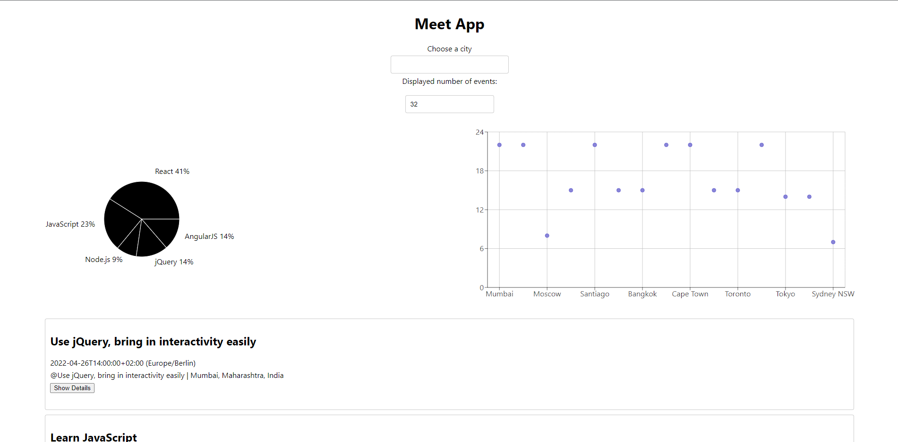

<!-- @format -->

Meet  
 
Purpose  
 
To build a serverless, progressive web application (PWA) built with React using a test-driven development (TDD) technique. The application uses the Google Calendar API to fetch upcoming events.  

 

Main View: 
On the main page users can search for events from different cities, specify a number of events they want the app to display and view visualization of the search data. 

Key Features 
The app uses OAuth2 authentication flow to allow the user to login. 
Users can install the app on their desktop or add it to their mobile home screen. 
The app is usable when offline. 
Users can filter events by city and specify the number of events shown on screen. 
A details button is clickable that will reveal additional info about an event. 
A Piechart and a Scatterplot visualize data about the displayed events. 
User Stories 
Feature 1: Filter Events by City 
User Story 
As a user I should be able to filter the events by city so that I can see the list of events that take place in that city 
 
Scenarios 
Scenario 1: When a user has not searched for a city, show upcoming events from all cities. 
 
Given a user has not searched for a city, 
When the user opens the app, 
Then the user should see all upcoming events from all cities. 
Scenario 2: A user should see a list of suggestions when they search for a city. 
 
Given a user wants to see all upcoming events in a specific city, 
When the user starts typing in the search bar, 
Then the user should see a list of suggestions of cities. 
Scenario 3: A user can select a city from the suggested list. 
 
Given a user types the name of a city in the input field, 
When the list of suggestions appears, 
Then the user can select that city for detailed view of events. 
Feature 2: Show/hide an event's details 
User Story: 
As a user, I should be able to show or hide an event's details so that I can see what an event is all about or hide that information. 
 
Scenarios 
Scenario 1: An event element is collapsed by default 
 
Given the app is loaded 
When the list of events is displayed 
Then the event elements are collapsed by default 
Scenario 2: A user can expand an event to see its details 
 
Given the event element is collapsed by default 
When the user clicks on the "Show Details" button for an event 
Then the event element will be expanded to show the event details 
Scenario 3: A user can collapse an event to hide its details 
 
Given the event element has been expanded to show details 
When the user clicks on the "Hide Details" button for an event 
Then the event element will collapse to hide its details 
Feature 3: Specify number of events 
User Story: 
As a user, I should be able to specify the number of events, so that I can see just how many events are going on in my city of choice. 
 
Scenarios
Scenario 1: When a user has not specified a number of events, 32 is the default number 
 
Given the user has loaded the app 
When the user has not specified a number of events 
Then the default number of events is 32 
Scenario 2: A user can change the number of events they want to see 
 
Given the user has loaded the app 
When the user changed the number of events they want to see 
Then the app renders the specified number of events 
Feature 4: The app is available when offline 
User Story: 
As a user, I want to use the app when offline, so that I can see a list of events when when I do not have an internet connection 
 
Scenarios 
Scenario 1: Show cached data when there is no internet connection 
 
Given the user is offline 
When the user opens the app 
Then the cached data is displayed 
Scenario 2: Show an alert when a user is offline 
 
Given the user is offline 
When the user opens the app 
Then an alert will show to notify the user about the missing internet connection 
Feature 5: Data visualization 
User Story: 
As a user, I want to be able to see a chart showing the number of upcoming events by city, so that I can get a better idea about how many events are taking place in that city 
 
Scenarios 
Scenario 1: Show a chart with the number of upcoming events in each city 
 
Given the main page is rendered 
When the event list is loaded 
Then the user should see a chart visualizing data about upcoming events 
Built with 
HTML/CSS 
JavaScript 
React 
Jest 
Cucumber 
Puppeteer 
Recharts 
